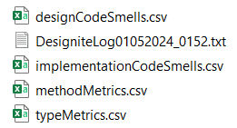
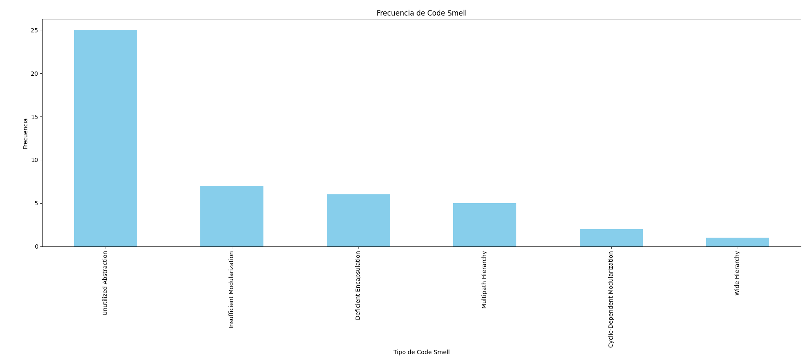
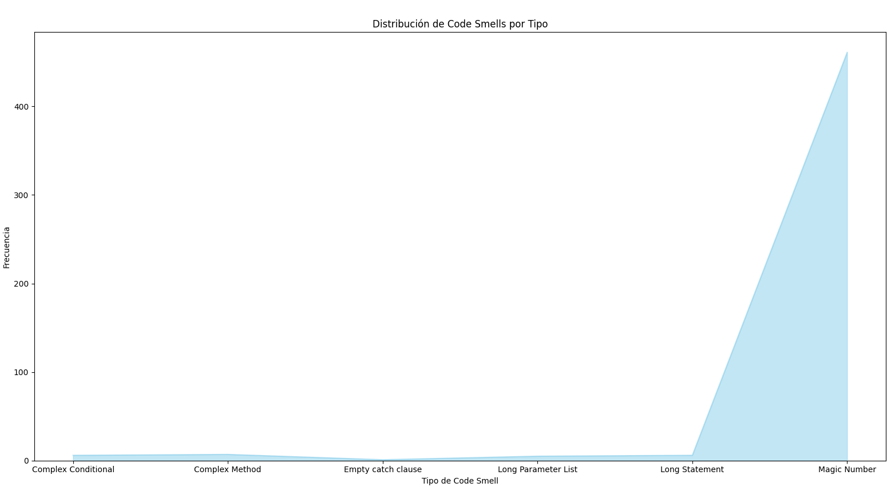
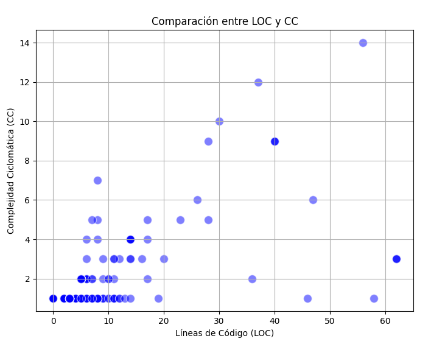
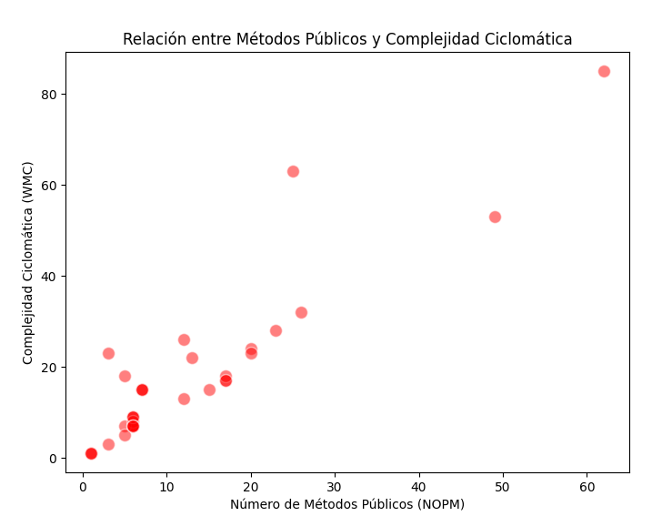
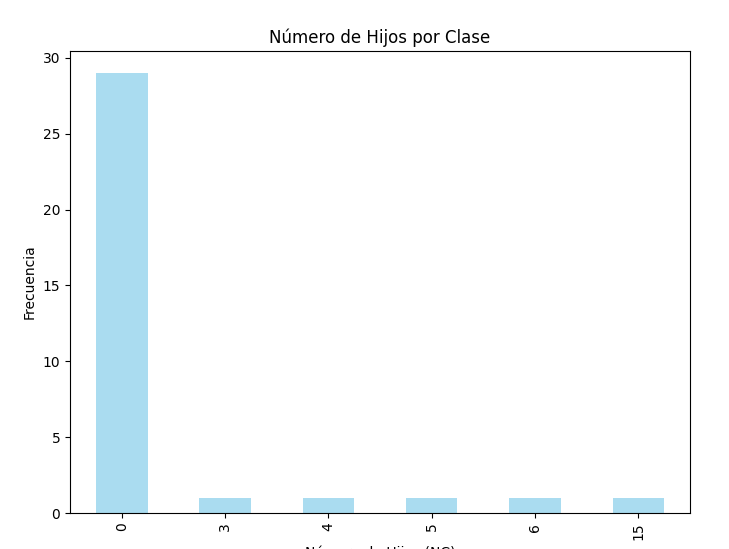
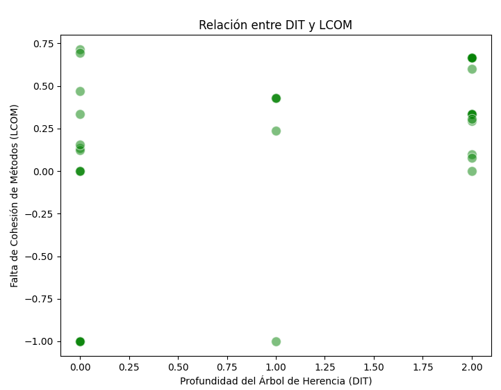

# Architectural Smells - designite

Este informe documenta el análisis de malas prácticas de arquitectura en un proyecto de software utilizando Designite, una herramienta que ayuda a identificar code smells y otros indicadores de technical debt. El objetivo es proporcionar información clara y concisa sobre las áreas del proyecto que pueden necesitar refactorización o mejora para mantener la calidad del código y facilitar el mantenimiento.

## ¿Qué es Designite?

Designite es una herramienta de análisis estático para proyectos de software, especialmente diseñada para detectar code smells, medir métricas de diseño y evaluar el technical debt en código Java. Ayuda a los desarrolladores y equipos de software a identificar problemas de calidad y diseño temprano en el ciclo de desarrollo, permitiendo tomar medidas para mejorar la estructura y el mantenimiento del código.

Los resultados de Designite incluyen varios tipos de métricas y análisis que se pueden utilizar para detectar problemas como:
- Complejidad ciclomática alta.
- Falta de cohesión entre métodos.
- Acoplamiento excesivo.
- Problemas de herencia y diseño de clases.

Al hacer uso de la herramienta, podemos encontrar que se generaron los siguietnes archivos: 

Gracias al una serie de programas en python se hizo el analisis grafico de cada uno de los csv presentes en el informe generado por la herramienta, arrojando los siguientes resultados:  

## Code Smells - Frecuencia
### Archivo: designCodeSmells.csv
Este archivo contiene información sobre diferentes tipos de "code smells" identificados en el proyecto. A continuación, se presenta un gráfico de barras que muestra la frecuencia de cada tipo de "code smell".
Las columnas presentes en el archivo son: **Project Name,Package Name,Type Name,Code Smell**

- **Descripción de la Gráfica**: El gráfico muestra cuántas veces aparece cada tipo de "code smell" en el proyecto. Los "code smells" son indicadores de potenciales problemas de calidad, como código duplicado, acoplamiento excesivo, o estructuras mal diseñadas.

## Code Smells - Distribución
### Archivo: implementationCodeSmells.csv
Este archivo contiene información sobre la distribución de los "code smells" en el proyecto. A continuación, se presenta un gráfico de área que muestra la frecuencia de cada tipo de "code smell".
Las columnas presentes en el archivo son: **Project Name,Package Name,Type Name,Method Name,Code Smell**

- **Descripción de la Gráfica**: Este gráfico de área muestra la frecuencia de cada tipo de "code smell". Puede ayudar a identificar áreas donde ciertos problemas son más frecuentes, como complejidad ciclomática alta o falta de cohesión.

## Comparación entre LOC y CC
### Archivo: methodMetrics.csv
Este archivo contiene información sobre las métricas de los métodos. La siguiente gráfica es un gráfico de dispersión que compara las líneas de código (LOC) con la complejidad ciclomática (CC).
Las columnas presentes en el archivo son: **Project Name,Package Name,Type Name,MethodName,LOC(Líneas de Código), CC(Complejidad Ciclomática), PC(Conteo de Parámetros)**

- **Descripción de la Gráfica**: El gráfico de dispersión muestra la relación entre el número de líneas de código y la complejidad ciclomática. Puede ayudar a identificar métodos que son complejos a pesar de tener pocas líneas, o viceversa, indicando posibles áreas de optimización.

## Análisis de Tipos y Clases
### Archivo: typeMetrics.csv
Este archivo contiene métricas relacionadas con tipos y clases. Se presentan tres gráficos para mostrar diferentes aspectos del diseño del proyecto.
Las columnas presentes en el archivo son: **Project Name,Package Name,Type Name, NOF (Number of Fields), NOPF (Number of Public Fields), NOM (Number of Methods), NOPM (Number of Public Methods), LOC (Líneas de Código), WMC (Weighted Methods per Class), NC (Number of Children), DIT (Depth of Inheritance Tree), LCOM (Lack of Cohesion of Methods), FANIN (Number of Incoming Dependencies), FANOUT (Number of Outgoing Dependencies).**

- **Relación entre Métodos Públicos y Complejidad Ciclomática**:
  

  Este gráfico de dispersión muestra la relación entre el número de métodos públicos y la complejidad ciclomática. Un alto número de métodos públicos puede indicar un mayor acoplamiento, mientras que un alto valor de WMC sugiere alta complejidad.

- **Número de Hijos por Clase**:
  

  El gráfico de barras muestra cuántas subclases tiene cada clase. Un número alto de hijos puede indicar un uso intensivo de herencia, lo cual puede complicar el mantenimiento del código.

- **Relación entre DIT y LCOM**:
  

  Este gráfico de dispersión muestra la relación entre la profundidad del árbol de herencia (DIT) y la falta de cohesión entre métodos (LCOM). Un DIT alto combinado con un LCOM alto puede ser un signo de arquitectura problemática y falta de cohesión.

## Conclusión

En conclusión, el proyecto muestra varios tipos de "Architectural Debt", los cuales fueron más fáciles de identificar gracias a la herramienta Designite. Su uso práctico y rápido la convierte en una herramienta valiosa para detectar estos problemas estructurales en el código y permite a los equipos abordar esos "gaps" o huecos en el diseño de manera proactiva. Designite ayuda a visualizar áreas problemáticas en el código y facilita la toma de decisiones informadas para mejorar la calidad y mantenibilidad del proyecto