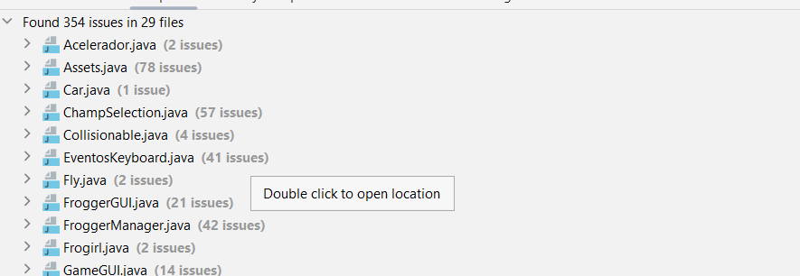

## Informe sobre Modelos de Calidad y Herramientas para Mejorar la Calidad del Software

### Introducción

El presente informe tiene como objetivo proporcionar un análisis exhaustivo de los modelos de calidad y las herramientas que pueden ser aplicados al proyecto actual para mejorar la calidad del software. Se examinarán los estándares ISO/IEC relevantes y se propondrán herramientas específicas para abordar las áreas de mejora identificadas en el código fuente.

### Modelos de Calidad

#### Frogger Test Debt (FTD)
El modelo de Frogger Test Debt ofrece una evaluación detallada de las prácticas de testing debt presentes en el proyecto. Identifica áreas críticas de mejora, como la falta de pruebas unitarias y la cobertura insuficiente. Se propone abordar estas deficiencias mediante la implementación de pruebas unitarias y la mejora de la cobertura de pruebas.

#### ISO/IEC 25010 - Sistema y Calidad del Producto de Software
El estándar ISO/IEC 25010 proporciona un marco para evaluar la calidad del producto de software en términos de características de calidad, como funcionalidad, fiabilidad, usabilidad, eficiencia, mantenibilidad y portabilidad. Se recomienda utilizar este estándar para identificar áreas específicas de mejora en el proyecto y establecer métricas de calidad cuantificables.

#### ISO/IEC 5055 - Medidas Automatizadas de Calidad del Código Fuente
El estándar ISO/IEC 5055 se centra en la calidad del código fuente y define medidas automatizadas para evaluar la calidad del mismo. Proporciona una lista de debilidades comunes en el código y patrones de detección que permiten la automatización del proceso de identificación de problemas de calidad. Se sugiere utilizar este estándar para complementar las pruebas manuales con análisis estático del código.

### Herramientas de Calidad

#### JUnit
JUnit es un marco de pruebas unitarias para Java que facilita la creación y ejecución de pruebas unitarias. Se propone utilizar JUnit para implementar pruebas unitarias en el proyecto, siguiendo las recomendaciones del modelo de Frogger Test Debt.

#### SonarLint
SonarLint es una herramienta de análisis estático del código que permite identificar y corregir problemas de calidad del código de manera automatizada. Se recomienda integrar SonarLint en el proceso de desarrollo para mejorar la calidad del código y mantener altos estándares de calidad.
Como parte del analisis sobre el código de Frogger pudimos observar estos resultados 

La mayoria de los errores presentes en el codigo son:
* Variables no utilizadas
* Bloques de código duplicados
* Violaciones de convenciones de codificación
* Código muerto
* Problemas de rendimiento
* Falta de comentarios y documentación

#### AI EvoSuite
EvoSuite es una herramienta revolucionaria que automatiza la creación de pruebas JUnit para clases Java, priorizando la cobertura de código, especialmente la cobertura de ramas. Utiliza un enfoque evolutivo basado en algoritmos genéticos para adaptarse y generar suites de pruebas eficientes. Destaca por su capacidad para minimizar las pruebas unitarias generadas, mejorando su legibilidad, y por incluir afirmaciones de regresión que validan el comportamiento actual de las clases bajo prueba, garantizando la efectividad de las pruebas.

### Conclusiones

El análisis de modelos de calidad y herramientas propuestas ofrece una visión integral de cómo mejorar la calidad del software en el proyecto actual. La implementación de pruebas unitarias, análisis estático del código y técnicas de IA para pruebas de regresión automatizadas puede ayudar a garantizar un código de alta calidad y un software robusto y confiable. Es fundamental documentar y seguir las mejores prácticas en la gestión de la calidad del software para garantizar el éxito del proyecto a largo plazo.